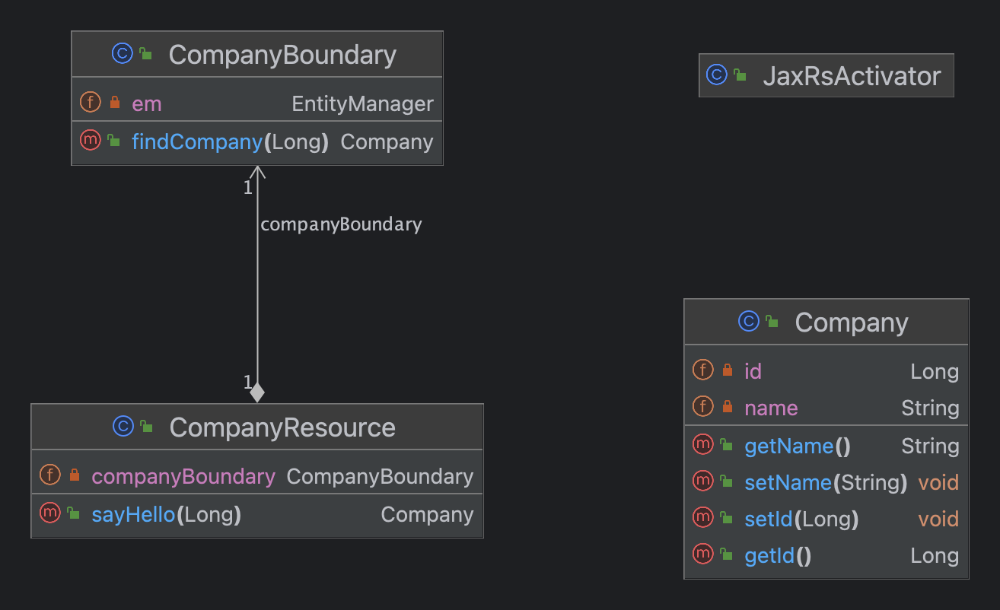
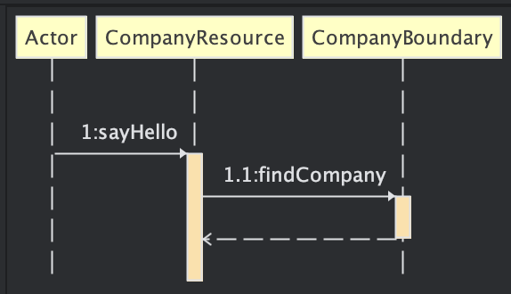
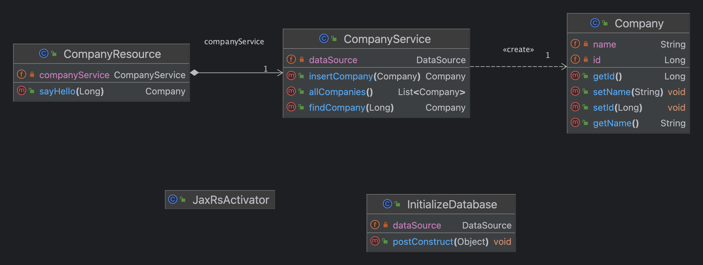
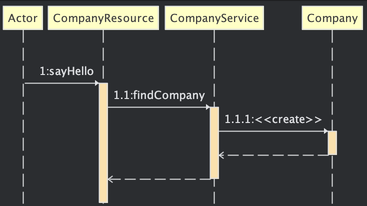

# Jakarta EE datasources hands-on

## Commands used

 ./asadmin start-domain domain1 (Starts Payara/Glassfish)
 
 ./asadmin stop-domain domain1 (Stops Payara/Glassfish)

./asadmin restart-domain domain1 (Restart Payara/Glassfish)
  
 ./asadmin list-domains (List the domains in execution)
  
 ./asadmin version (version of Payara/Glassfish installed)
  

## Example 01 - Creating a datasource with default JNDI name (jdbc/__default) and JPA

<a href="Source_Code/01/datasource-jpa">01 - Creating a datasource with default JNDI name and JPA</a> 

 ./asadmin deploy target/datasource-jpa-1.0-SNAPSHOT.war (Deploy to the Glassfish/Payara)
  
 ./asadmin redeploy --name datasource-jpa-1.0-SNAPSHOT target/datasource-jpa-1.0-SNAPSHOT.war (Redeploy to the Glassfish/Payara. The parameter --name only worked when I used the name of the war file, without war).

curl localhost:8080/datasource-jpa-1.0-SNAPSHOT/rest/company/1

 

  

## Example 02 - Creating a datasource with default JNDI name (jdbc/__default) and JDBC

<a href="Source_Code/02/datasource-jdbc">02 - Creating a datasource with default JNDI name and JDBC</a> 

 ./asadmin deploy target/datasource-jpa-1.0-SNAPSHOT.war (Deploy to the Glassfish/Payara)
  
 ./asadmin redeploy --name datasource-jdbc-1.0-SNAPSHOT target/datasource-jdbc-1.0-SNAPSHOT.war (Redeploy to the Glassfish/Payara. The parameter --name only worked when I used the name of the war file, without war).

curl localhost:8080/datasource-jdbc-1.0-SNAPSHOT/rest/company/1

  
